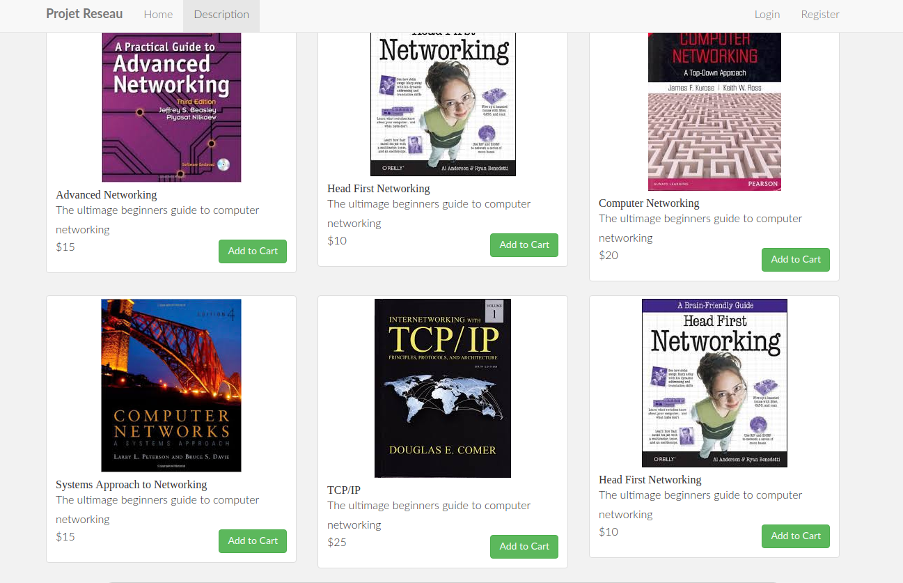

# Shopping-Cart-Laravel
A mini shopping cart web app powered by laravel framework. 


## Getting Started

These instructions will get you a copy of the project up and running on your local machine for development and testing purposes. The projects 

### Prerequisites

To follow this tutorial with minimal hiccups you need Ubuntu 16.04 server and a non-root user with sudo priviledges. Install mysql server and PhpMyAdmin to further facilate your work. Installing those packages is beyond the scope of this tutorial...

## Install Composer 
Composer is a php dependency management tool. Open your linux terminal and install it using the following commands: 

```
curl -sS https://getcomposer.org/installer | php
sudo mv composer.phar /usr/local/bin/composer

```
Clone the project to your local machine

```
git clone https://github.com/Yuhala/shopping-cart-laravel.git

```
Update dependencies: cd into the shopping-cart-laravel directory and type the following command

```
composer update

```
## Deploying the app on your local machine 

- Create a mysql database called _shopping-cart_
- Open the _.env_ file in the main project directory and modify accordingly

```
APP_ENV=local
APP_KEY=base64:B9llUkf+8LyJvR16JCIb8rHC8dIfpKrDlM+XRMJNAsE=
APP_DEBUG=true
APP_LOG_LEVEL=debug
APP_URL=http://localhost

DB_CONNECTION=mysql
DB_HOST=127.0.0.1
DB_PORT=3306
DB_DATABASE=shopping-cart
DB_USERNAME=yourusername
DB_PASSWORD=yourpassword

```
- Run the migrations so as to create the database tables
```
php artisan migrate

```
- Seed the database with the database seeder

```
php artisan db:seed

```
- Run the laravel project 

```
php artisan serve

```
- Enter the link in your browser : the link should probably be : _http://localhost:8000_

- If you see the following webpage, you are good to go...



## How to use the program

.....

## Built With

* [Laravel Framework](https://laravel.com/) - A free open-source PHP web framework.
<p align="center"></p>

<p align="center">
<a href="https://travis-ci.org/laravel/framework"></a>
<a href="https://packagist.org/packages/laravel/framework"></a>
<a href="https://packagist.org/packages/laravel/framework"></a>
<a href="https://packagist.org/packages/laravel/framework"></a>
</p>


## Authors

* **Peterson Yuhala** 


## License

This project is licensed under the MIT License - see the [LICENSE](LICENSE) file for details

## Acknowledgments

* Acacha : https://github.com/acacha/adminlte-laravel 

